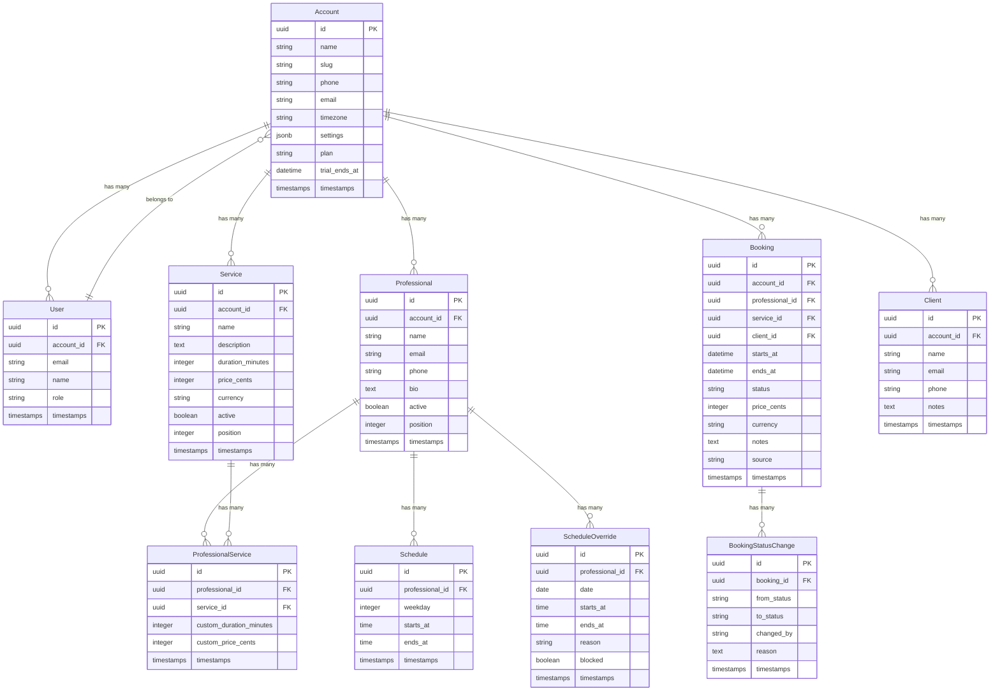

# AgendaAI — Plano de Arquitetura

> **Tipo:** Projeto Greenfield (sem código existente)
> **Baseado em:** [FEATURES.md](file:///home/thigas/agenda-ai/docs/product/FEATURES.md) e [ROADMAP.md](file:///home/thigas/agenda-ai/docs/product/ROADMAP.md)

---

## Resumo

AgendaAI é uma plataforma SaaS multi-tenant de agendamento genérica para o mercado brasileiro. Qualquer negócio baseado em serviços (clínicas, salões, consultorias, academias, etc.) pode oferecer reservas online via uma página pública personalizável. O MVP cobre cadastro de profissionais/serviços, painel administrativo, booking page pública, autenticação e multi-tenancy básico.

---

## User Review Required

> [!IMPORTANT]
> **Stack Decisions** — O projeto é novo e não possui stack definida. As escolhas abaixo são recomendações baseadas nas features do produto. Favor validar antes da execução.

> [!IMPORTANT]
> **Multi-tenancy Strategy** — Recomendo `acts_as_tenant` com `account_id` em todas as tabelas (shared database). Multi-tenant por schema ou banco separado pode ser considerado no futuro, mas adiciona complexidade desnecessária para o MVP.

> [!WARNING]
> **Subdomínios vs. Path-based** — O FEATURES.md menciona URLs como `agendaai.com.br/nome-do-negocio`. Isso sugere path-based routing para booking pages. Subdomínios (`nome.agendaai.com.br`) estão listados como feature futura. Confirme a abordagem preferida.

---

## Open Questions

1. **Domínio de deploy:** Qual será o domínio principal? (`agendaai.com.br`?)
2. **Hospedagem:** Preferência por plataforma? (Render, Fly.io, AWS, Hetzner + Kamal?)
3. **Frontend admin:** Hotwire/Turbo (Rails nativo) ou SPA (React/Next.js)?
   - **Minha recomendação:** Hotwire — reduz complexidade, time-to-market menor, excelente para CRUD-heavy + calendário.
4. **Testing framework:** RSpec ou Minitest?
   - **Minha recomendação:** RSpec — ecossistema mais rico para SaaS (FactoryBot, Shoulda Matchers, VCR).
5. **Idioma do código:** Inglês (padrão internacional) ou Português nos models/controllers?
   - **Minha recomendação:** Inglês para código, Português para UI (i18n).

---

## Stack Recomendada

| Camada | Tecnologia | Versão | Justificativa |
|---|---|---|---|
| **Linguagem** | Ruby | 3.3+ | Latest stable, YJIT habilitado |
| **Framework** | Rails | 8.0+ | Solid Queue, Solid Cache, Solid Cable nativos |
| **Banco de dados** | PostgreSQL | 17+ | Melhor suporte a UUID, JSONB, full-text search |
| **Cache/Jobs/WS** | Solid Queue / Solid Cache / Solid Cable | Built-in Rails 8 | Elimina Redis como dependência |
| **Frontend** | Hotwire (Turbo + Stimulus) | Rails 8 default | Produtividade + UX reativa sem SPA |
| **CSS** | Tailwind CSS | 4.x | Integração nativa Rails 8, produtividade |
| **Auth** | Devise | 4.9+ | Padrão de mercado, extensível |
| **Multi-tenancy** | acts_as_tenant | Latest | Simples, shared database |
| **Pagamentos** | pay gem + Stripe/MercadoPago | Latest | Abstração para múltiplos gateways |
| **Email** | Action Mailer + Resend/Postmark | Latest | Deliverability alta |
| **WhatsApp** | Evolution API ou Z-API | Latest | APIs brasileiras, custo acessível |
| **Testes** | RSpec + FactoryBot | Latest | Ecossistema completo |
| **Linter** | RuboCop + erb_lint | Latest | Consistência de código |
| **Deploy** | Kamal 2 | Latest | Docker-based, zero-downtime |

---

## Schema Design (Banco de Dados)

### Diagrama ER



### Design Decisions

| Decisão | Justificativa |
|---|---|
| **UUIDs como PK** | URLs previsíveis são risco de segurança em booking pages públicas. UUIDs eliminam enumeração. |
| **`price_cents` (integer)** | Evita problemas de floating point. Sempre armazenar centavos. |
| **`ProfessionalService` (join table)** | Permite override de preço/duração por profissional sem duplicar serviço. |
| **`Schedule` (horários recorrentes)** | Um registro por bloco de horário por dia da semana. Ex: Seg 08:00-12:00, Seg 14:00-18:00. |
| **`ScheduleOverride`** | Férias, folgas, horários especiais. `blocked: true` = indisponível naquela data. |
| **`BookingStatusChange`** | Audit trail completo de mudanças de status (compliance + analytics). |
| **`Account.slug`** | Usado na URL pública: `/slug/book`. Unique, validado. |
| **`Account.settings` (JSONB)** | Configurações flexíveis: cor da marca, política de cancelamento, fuso horário, etc. |
| **`Booking.source`** | Rastreamento de origem: `"public_page"`, `"admin"`, `"api"`. |

---

## Arquitetura de Componentes

### Models & Concerns

| Model | Responsabilidade | Concerns/Mixins |
|---|---|---|
| `Account` | Tenant raiz, configurações do negócio | `Sluggable`, `Configurable` |
| `User` | Autenticação e autorização | Devise modules |
| `Professional` | Profissional vinculado ao negócio | `Schedulable`, `Sortable` |
| `Service` | Serviço oferecido | `Sortable` |
| `ProfessionalService` | Vínculo profissional↔serviço com override | — |
| `Schedule` | Horários recorrentes semanais | `TimeSlottable` |
| `ScheduleOverride` | Exceções de agenda (folgas, feriados) | — |
| `Client` | Cliente final que faz agendamentos | `Searchable` |
| `Booking` | Agendamento | `StatusMachine`, `Auditable` |
| `BookingStatusChange` | Histórico de mudanças | — |

### Controllers

```
app/controllers/
├── application_controller.rb
├── registrations_controller.rb          # Devise customizado
│
├── admin/                               # Namespace autenticado
│   ├── base_controller.rb              # set_current_tenant
│   ├── dashboard_controller.rb         # F2: Dashboard + métricas
│   ├── professionals_controller.rb     # F1: CRUD profissionais
│   ├── services_controller.rb          # F1: CRUD serviços
│   ├── bookings_controller.rb          # F2: Gestão de agendamentos
│   ├── clients_controller.rb           # Lista/busca clientes
│   └── settings_controller.rb          # Configurações do negócio
│
├── public/                              # Namespace público (sem auth)
│   ├── base_controller.rb             # resolve account by slug
│   ├── booking_pages_controller.rb    # F3: Página de agendamento
│   └── bookings_controller.rb         # F3: Criação de booking
│
└── api/                                 # API JSON (futuro)
    └── v1/
        └── ...
```

### Service Objects

| Service | Responsabilidade |
|---|---|
| `Bookings::CreateService` | Validação de disponibilidade + criação do booking |
| `Bookings::CancelService` | Cancelamento com política de reembolso |
| `Bookings::RescheduleService` | Reagendamento com checagem de conflito |
| `Availability::CalculatorService` | Calcula slots disponíveis (schedule - overrides - bookings existentes) |
| `Availability::SlotGeneratorService` | Gera time slots baseado na duração do serviço |
| `Accounts::OnboardingService` | Setup inicial do tenant (account + user + defaults) |

### Jobs (Solid Queue)

| Job | Trigger | Responsabilidade |
|---|---|---|
| `SendBookingConfirmationJob` | Após criação de booking | Email de confirmação |
| `SendBookingReminderJob` | Cron (24h e 1h antes) | Lembrete por email/WhatsApp |
| `SendCancellationNotificationJob` | Após cancelamento | Notificação de cancelamento |
| `ExpireTrialJob` | Cron diário | Verifica e expira trials |

---

## Rotas Principais

```ruby
# config/routes.rb

Rails.application.routes.draw do
  devise_for :users

  # Admin (autenticado)
  namespace :admin do
    root to: "dashboard#index"

    resources :professionals do
      resources :schedules, only: [:index, :create, :update, :destroy]
      resources :schedule_overrides, only: [:index, :create, :update, :destroy]
    end

    resources :services
    resources :bookings do
      member do
        patch :confirm
        patch :complete
        patch :cancel
        patch :no_show
      end
    end
    resources :clients, only: [:index, :show]
    resource :settings, only: [:show, :update]
  end

  # Booking Page pública
  scope "/:slug" do
    get "/", to: "public/booking_pages#show", as: :public_booking_page
    get "/book", to: "public/bookings#new", as: :new_public_booking
    post "/book", to: "public/bookings#create", as: :public_bookings
    get "/book/confirmation/:id", to: "public/bookings#confirmation", as: :public_booking_confirmation
  end

  root to: "pages#landing"
end
```

---

## Multi-tenancy Strategy

```ruby
# app/controllers/admin/base_controller.rb
class Admin::BaseController < ApplicationController
  before_action :authenticate_user!
  set_current_tenant_through_filter
  before_action :set_tenant

  private

  def set_tenant
    set_current_tenant(current_user.account)
  end
end

# app/controllers/public/base_controller.rb
class Public::BaseController < ApplicationController
  set_current_tenant_through_filter
  before_action :set_tenant_by_slug

  private

  def set_tenant_by_slug
    account = Account.find_by!(slug: params[:slug])
    set_current_tenant(account)
  end
end
```

---

## Availability Engine (Core Business Logic)

O motor de disponibilidade é o componente mais crítico da aplicação:

```
                        ┌─────────────────────────────┐
                        │  Availability::Calculator    │
                        │                             │
  Inputs:               │  1. Load weekly Schedule    │
  - professional_id     │  2. Apply ScheduleOverrides │
  - service_id          │  3. Subtract existing       │
  - date_range          │     Bookings                │
                        │  4. Generate available      │
                        │     TimeSlots               │
                        │                             │
                        │  Output: Array<TimeSlot>    │
                        └─────────────────────────────┘
```

**Algoritmo:**
1. Para cada dia no `date_range`, buscar o `Schedule` do `weekday` correspondente
2. Aplicar `ScheduleOverride` (se `blocked: true` → dia inteiro indisponível; senão, usar horários customizados)
3. Subtrair `Bookings` existentes (status != `cancelled`) daquele profissional naquele dia
4. Gerar slots baseados na `duration_minutes` do serviço (com buffer configurável entre appointments)
5. Retornar apenas slots futuros (> `Time.current`)

---

## Ordem de Implementação (baseada no WSJF do Roadmap)

| Fase | Sprint | Escopo | Dependências |
|---|---|---|---|
| **0. Bootstrap** | 0 | Rails new, configs, CI, Docker, seeds | Nenhuma |
| **1. Auth & Onboarding** | 1 | Devise, Account, User, sign up flow | Fase 0 |
| **2. F1 — Profissionais & Serviços** | 1-2 | CRUD completo, Schedule, ScheduleOverride | Fase 1 |
| **3. F3 — Booking Page** | 2-3 | Página pública, Availability Engine, Client, Booking | Fase 2 |
| **4. F2 — Painel Admin** | 3 | Dashboard, gestão de bookings, métricas | Fase 3 |
| **5. Multi-tenancy refinamento** | 3 | acts_as_tenant em todos models, testes de isolamento | Fase 1 |

---

## Estrutura de Diretórios (Proposta)

```
agenda-ai/
├── app/
│   ├── controllers/
│   │   ├── admin/
│   │   └── public/
│   ├── models/
│   │   └── concerns/
│   ├── services/
│   │   ├── availability/
│   │   ├── bookings/
│   │   └── accounts/
│   ├── jobs/
│   ├── mailers/
│   ├── views/
│   │   ├── admin/
│   │   ├── public/
│   │   └── layouts/
│   └── components/           # ViewComponent (opcional)
├── config/
├── db/
│   └── migrate/
├── docs/
│   ├── product/              # Existente
│   ├── architecture/         # ADRs e diagramas
│   └── plans/                # Implementation plans por feature
├── spec/
│   ├── models/
│   ├── services/
│   ├── requests/
│   ├── system/
│   └── factories/
└── ...
```

---

## Verification Plan

### Automated Tests
```bash
# Após bootstrap
bin/rails db:create db:migrate
bundle exec rspec

# Lint
bundle exec rubocop
```

### Manual Verification
- Criar uma conta, configurar 1 profissional + 1 serviço
- Acessar booking page pública via slug
- Realizar um agendamento como cliente
- Confirmar no painel admin
- Verificar isolamento de dados entre tenants

---

## Próximos Passos

Após aprovação deste plano:
1. **Bootstrap** — `rails new agenda-ai` com as configurações definidas
2. **Gerar migrations** — Schema completo conforme diagrama ER
3. **Implementar Fase 1** — Auth & Onboarding
4. Seguir ordem do backlog fase a fase
